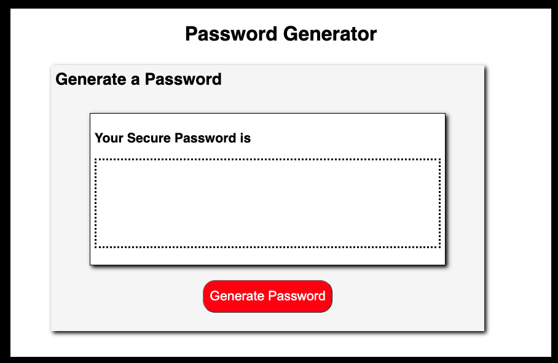
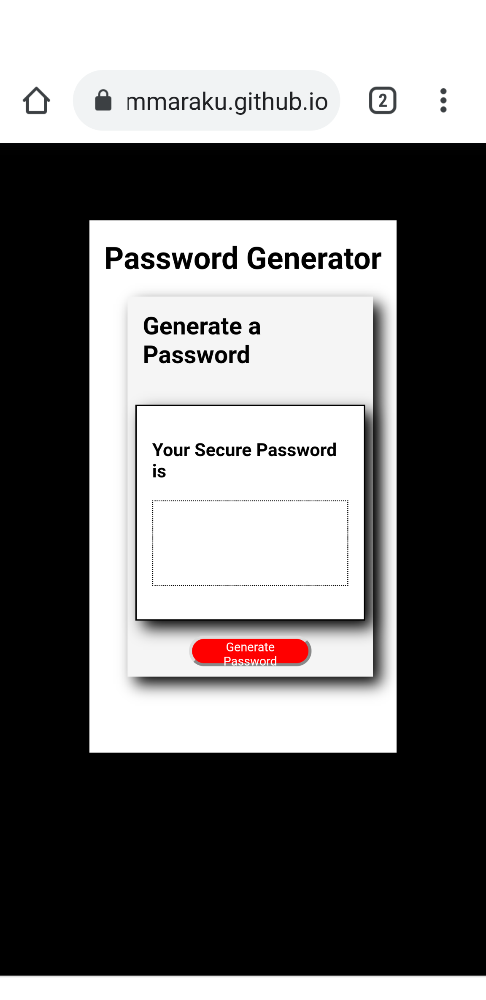

# Homework_03_password_generator

## Objective
To create an application (Password Generator) by using Javascript to meet below requirements
- Dynamically updated HTML and CSS by using Javascript.
- Responsive interface, adapts to multiple screen sizes.
- Provide prompts for password criteria.
- Offer password length between 8 and 128 characters.
- Password should at least has one character type should be selected.

## Application

### Github Repository URL
https://github.com/thammaraku/homework_03_password_generator

### Github Page URL
https://thammaraku.github.io/homework_03_password_generator/

### Screenshot

## Knowledge learned from this assignment
1. Javascript structure and syntax
2. Javascript HTML DOM : select element, change element style and add content to an element
3. Javasctipt if statement, for loop and while loop
4. Using console.log for debuggin purpose.
5. String and Array method

## License
No license required on this public web page.